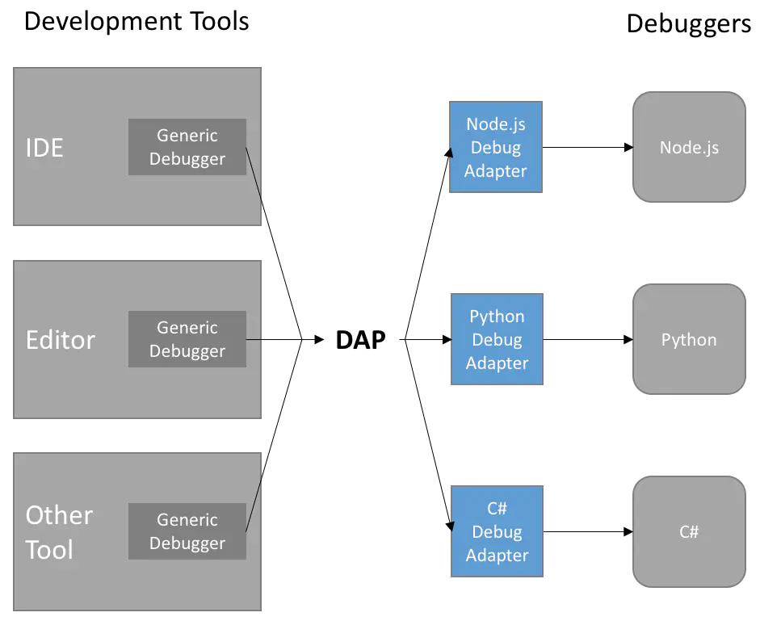
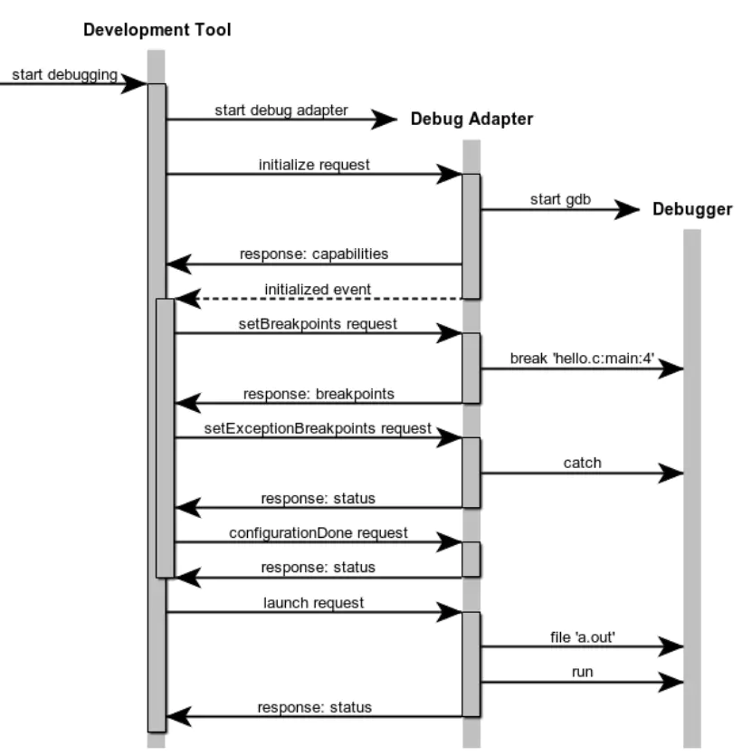

# 我们为什么需要debugger

每个刚入行的程序员都有过对调试器一知半解的时候，那时我们使用 **printf**，**console.log**, **System.out.println** 等进行错误定位，统称**打印输出调试法**，这个方法至今在服务器后端等无法停机更无法挂调试器的地方大行其道，我们叫它**log日志**。
当我们工作了几年，逐渐发现了编程世界的复杂性，有些问题无法通过简单的打印来定位：
1. 程序内某个变量的值被改掉了，我想知道是哪里改的
2. 两个相同的组件，一个表现正常一个不正常，why?
3. 程序存在死锁或其他多线程静态条件，怎么定位和修复？
4. 我的程序内存泄露了，怎么办

上面列举的一些情况有些可以借助debugger，有些如内存泄露，还需要借助其他的分析工具，但不可否认的是，debugger是程序员修bug奋斗之路上最坚实的后盾。代码出了问题，你能依靠的只有你自己的逻辑和你手里的调试工具。哦，当然，你也可以选择摇人，这个不在本文讨论范围之内。

我们都会用到debugger，它一般提供如下功能：
1. 断点
2. 单步执行
4. 查看，修改变量值

调试功能我们常用，但就是因为它太常用了，是语言附属的基础设施，所以我们好像很少会去思考，它是如何实现的？

<!-- more -->

# 调试器是怎么实现的

在聊JS调试器之前，我们先聊一聊关于调试器更通用的一些东西，理解软件调试技术在实现层面的一些思路和细节。

## 调试器的架构
传统的调试器实现，一般分为调试器前端（Fortended）和调试器后端（Backend）。前端用于展示，后端实现调试功能。这种架构很经典，后端专注于调试功能实现，前端专注于展示界面，前后端之间使用IPC通信进行通信。

## VSCode和DAP协议

在VSCode出现之前，调试器基本是IDE的专属，一个单纯的editor是很难和调试器进行整合的，面临如下困难：

1. 不同的调试后端之间并没有提供统一的接口，对接不通语言的调试器或者统一语言的不通调试器实现工作量巨大
2. 不同的调试器功能并不完全一致，没办法统一去实现，前端的实现和特定后端绑定

所以在VSCode出来之后，微软跳了出来做了标准化：[DAP协议](https://microsoft.github.io/debug-adapter-protocol/specification)（微软也推出了代码提示的标准[LSP协议](https://microsoft.github.io/language-server-protocol/)，让emacs，vim等编辑器也跟着鸟枪换炮），DAP基于JSON实现的通信协议，VSCode作为DAP协议的前端，开发者可以专注于实现后端，后端要做的就是接收JSON请求，执行功能，以JSON返回执行结果。
软件行业的杀手锏就是标准化，一旦某个东西标准化并被接受成为事实标准，一切就变得简单起来了，因为标准化是通用轮子的基础，有了轮子还要啥自行车。

DAP协议下调试器的实现


DAP协议下gdb调试器工作原理


## 调试器后端实现

关于DAP协议和VSCode调试界面，不在本文的讨论范围之内。关于调试器前端实现，感兴趣的同学可以参考[vscode-mock-debug](https://github.com/microsoft/vscode-mock-debug)，它给出了一个调试器前端的通用实现。
本文专注于调试器后端实现，接下来我们会聊一聊调试器后端要实现的主要功能和实现思路。

### 如何暂停
debugger的一个核心功能便是要让程序能够在特定的情况下中断执行（命中断点），然后让用户控制程序一步一步往下跑，以观察执行过程中程序具体行为，每一步操作是否符合预期。所以这里**暂停执行**是关键。
所以，谁才有能力暂停一个程序的执行呢？如果你使用的是C/C++/Rust/go这种可以编译到汇编的语言，进程，线程等机制是由操作系统实现的，进程和线程的调度也是由系统实现，所以操作系统理应有能力**暂停**一个程序的执行。所以聪明的你可能想到了，对于这类程序，调试功能是由**操作系统**提供的，具体来说是操作系统的**调试子系统**。这类语言的调试器直接依赖于操作系统提供的调试API来实现（linux上一般是gdb/lldb）。
我们按照这个思路递推，如果是js呢？谁有能力暂停一个js程序的执行？理所应当是js引擎。所以对于js语言，调试功能应该在**js引擎**层予以支持和实现。


### 如何在源码层面命中断点和单步执行

我们把这两个放在一起说，因为它们具有一定的相似性，都是要完成从源码到字节码的转换。

语言的编译是一个翻译过程，一般用于将一种高级的，表达能力强的语言，翻译成一种低级的，表达能力弱的语言或者是生成对应的字节码。
> 对于C/C++语言，编译后生成的是二进制程序，它直接对应于机器汇编，由cpu直接执行。
> 对于js语言，编译后生成js字节码，由js引擎解释执行。

一般来说，一句C或者js代码经过编译后会生成多条汇编指令或者字节码指令。这是由**信息密度**决定的，高级语言的信息密度比汇编/字节码要高（这也是为什么我们不直接写汇编/字节码，而是搞了个编译器去生成它），所以翻译后会带来操作（汇编指令/字节码指令）数量的膨胀。当我们实现调试器的时候，我们要面临的首要问题就是：
>如何将字节码/汇编代码与JS/C++源码进行对应？

解决方案是什么？其实并不复杂，我们需要一个映射关系，用来告诉debugger，字节码执行到这里，应该对应到源码的哪个文件的哪一行，用户单步执行一次，需要执行几个字节码指令。断点的设置也是一样，我们需要知道用户在某个文件的某一行设置的断点到底应该对应到汇编/字节码的哪个指令上。
（有没有同学想到js里的source map?思路是一样的）
命中断点则是在每次执行时，检查当前的程序计数器PC是否执行到了我们设置断点的地方，即可得知是否命中断点，如果命中断点则中断程序的执行（对C++,暂停其所在线程的执行，对JS，不再继续解释下一条指令）。
这个映射关系在C++里被称作调试符号，windows上vs会单独生成这个文件后缀名是.pdb（Programing Database），linux上gcc选择将调试符号直接嵌入到二进制文件中，可以通过strip命令去除。
在js里，好像并不单独存在这样一个文件，因为js编译生成的字节码一般情况下并不会被保存在硬盘上，这个信息在js引擎编译js源码时被记录在了引擎里。

### 如何查看和修改变量的值

debugger接管了程序的执行过程，在程序暂停时，debugger可以清楚地知道当前有几个变量，各自是什么名字，值是什么，也就允许我们在运行时动态的修改它，这个并不复杂，我们不展开细讲。

# 怎么实现一个js debugger

聊了这么久，我们终于开到了喜闻乐见的**show me the code**环节。在这里我们解析quickjs中针对调试功能的具体实现，我们会更多借助伪代码来展示整体流程，以避免过多地陷入具体的实现细节。

## quickjs调试功能实现

### JS函数功能执行入口

此函数是JS字节码解释的核心函数，极长，有**2543行**之巨，处理了方方面面的情况，整体是一个超级巨大的switch，根据字节码的opcode进行解释执行。

````C
static JSValue JS_CallInternal(JSContext *caller_ctx, JSValueConst func_obj,
                               JSValueConst this_obj, JSValueConst new_target,
                               int argc, JSValue *argv, int flags)
{
    //必要的检测和初始化
    ....

//定义CASE宏，执行每个字节码分支的时候，都会执行js_debugger_check以执行调试检测
#define CASE(op)        case_debugger_ ## op: js_debugger_check(ctx, pc); case_ ## op
    
 restart:
    for(;;) {
        int call_argc;
        JSValue *call_argv;

        //调试检测函数
#ifdef AIOTJS_ENABLE_SIM_DEBUG
        js_debugger_check(ctx, NULL);
#endif

        //根据opcode进行dispatch处理
        SWITCH(pc) {
        CASE(OP_push_i32):
            *sp++ = JS_NewInt32(ctx, get_u32(pc));
            pc += 4;
            BREAK;
        CASE(OP_push_const):
            *sp++ = JS_DupValue(ctx, b->cpool[get_u32(pc)]);
            pc += 4;
            BREAK;
#if SHORT_OPCODES
        CASE(OP_push_minus1):
        CASE(OP_push_0):
        CASE(OP_push_1):
        CASE(OP_push_2):
        CASE(OP_push_3):
        CASE(OP_push_4):
        CASE(OP_push_5):
        CASE(OP_push_6):
        CASE(OP_push_7):
            *sp++ = JS_NewInt32(ctx, opcode - OP_push_0);
            BREAK;
        CASE(OP_push_i8):
            *sp++ = JS_NewInt32(ctx, get_i8(pc));
            pc += 1;
            BREAK;
        CASE(OP_push_i16):
            *sp++ = JS_NewInt32(ctx, get_i16(pc));
            pc += 2;
            BREAK;
        CASE(OP_push_const8):
            *sp++ = JS_DupValue(ctx, b->cpool[*pc++]);
            BREAK;
        CASE(OP_fclosure8):
            *sp++ = js_closure(ctx, JS_DupValue(ctx, b->cpool[*pc++]), var_refs, sf);
            if (unlikely(JS_IsException(sp[-1])))
                goto exception;
            BREAK;
        CASE(OP_push_empty_string):
            *sp++ = JS_AtomToString(ctx, JS_ATOM_empty_string);
            BREAK;
    }
    //异常处理
 exception:
    ....

    //清理及返回
    ...
    return ret_val;
}
````

### 调试功能入口
````C
void js_debugger_check(JSContext* ctx, const uint8_t *cur_pc) {
    //调用js_debugger_check之前需要设置通知函数
    JSDebuggerInfo *info = js_debugger_info(JS_GetRuntime(ctx));
    if (info->is_debugging)
        return;
    if (info->debugging_ctx == ctx)
        return;
    info->is_debugging = 1;
    // info->ctx = ctx;

    //根据两个特定的环境变量来连接调试器
    if (!info->attempted_connect) {
        info->attempted_connect = 1;
        char *address = getenv("QUICKJS_DEBUG_ADDRESS");
        if (address != NULL && !info->transport_close)
            //前端先启动，后端直接连接，无阻塞，无法连接则报错
            js_debugger_connect(ctx, address, g_debugger_attach_notify);
    }
    else if (!info->attempted_wait) {
        info->attempted_wait = 1;
        char *address = getenv("QUICKJS_DEBUG_LISTEN_ADDRESS");
        if (address != NULL && !info->transport_close)
            //后端阻塞直到连接到前端
            js_debugger_wait_connection(ctx, address, g_debugger_attach_notify);
    }

    if (info->transport_close == NULL)
        goto done;

    struct JSDebuggerLocation location;
    int depth;

    //已暂停，单步执行中，检测location和depth
    if (info->stepping) {
        ...
        if (已到达step位置)
            goto done;
    }

    //检测是否命中断点
    int at_breakpoint = js_debugger_check_breakpoint(ctx, info->breakpoints_dirty_counter, cur_pc);
    if (at_breakpoint) {
        // 命中已存在的断点，向vscode发送暂停消息，暂停原因为 breakpoint
        info->stepping = 0;
        info->is_paused = 1;
        js_send_stopped_event(info, "breakpoint");
    }
    else if (info->stepping) {
        //单步执行 continue
        if (info->stepping == JS_DEBUGGER_STEP_CONTINUE) {
            info->stepping = 0;
        }
        else if (info->stepping == JS_DEBUGGER_STEP_IN) {
            //单步执行 step in
            int depth = js_debugger_stack_depth(ctx);
            
            if (info->step_depth == depth) {
                struct JSDebuggerLocation location = js_debugger_current_location(ctx, cur_pc);
                if (location.filename == info->step_over.filename
                    && location.line == info->step_over.line
                    && location.column == info->step_over.column)
                    goto done;
            }
            info->stepping = 0;
            info->is_paused = 1;
            js_send_stopped_event(info, "stepIn");
        }
        else if (info->stepping == JS_DEBUGGER_STEP_OUT) {
            //单步执行 step out
            int depth = js_debugger_stack_depth(ctx);
            if (depth >= info->step_depth)
                goto done;
            info->stepping = 0;
            info->is_paused = 1;
            js_send_stopped_event(info, "stepOut");
        }
        else if (info->stepping == JS_DEBUGGER_STEP) {
            //单步执行 step
            struct JSDebuggerLocation location = js_debugger_current_location(ctx, cur_pc);
            // to step over, need to make sure the location changes,
            // and that the location change isn't into a function call (deeper stack).
            if (已到达step位置)
                goto done;
            info->stepping = 0;
            info->is_paused = 1;
            js_send_stopped_event(info, "step");
        }
        else {
            // ???
            info->stepping = 0;
        }
    }

    //读取并处理调试消息，主要是从前端发送的命令请求，入断点，查询变量值等
    //内部调用了js_process_debugger_messages
    int ret = js_debugger_process_server_message(ctx);
    if(ret == -1)
        goto fail;
    else if(ret == 1)
        goto done;
    //前端调试命令处理函数
    if (js_process_debugger_messages(info, cur_pc))
        goto done;

    fail: 
        js_debugger_free(JS_GetRuntime(ctx), info);
    done:
        info->is_debugging = 0;
        // info->ctx = NULL;
}
````

### 前端调试命令处理

````C
static int js_process_debugger_messages(JSDebuggerInfo *info, const uint8_t *cur_pc) {
    // continue processing messages until the continue message is received.
    JSContext *ctx = info->ctx;
    if(ctx == 0)
        return 0;
    struct DebuggerSuspendedState state;
    state.variable_reference_count = js_debugger_stack_depth(ctx) << 2;
    state.variable_pointers = JS_NewObject(ctx);
    state.variable_references = JS_NewObject(ctx);
    state.cur_pc = cur_pc;
    int ret = 0;
    char message_length_buf[10];

    do {
        //检测和分配buffer缓冲区
        ...

        //从socket中读取前端发来的json命令
        if (!js_transport_read_fully(info, info->message_buffer, message_length))
            goto done;
        
        info->message_buffer[message_length] = '\0';

        //JSON.parse转换成js json对象
        ...

        //解析请求类型
        if (strcmp("request", type) == 0) {
            //request请求
            js_process_request(info, &state, JS_GetPropertyStr(ctx, message, "request"));
            // done_processing = 1;
        }
        else if (strcmp("continue", type) == 0) {
            //继续执行
            info->is_paused = 0;
        }
        else if (strcmp("breakpoints", type) == 0) {
            //处理断点消息
            js_process_breakpoints(info, JS_GetPropertyStr(ctx, message, "breakpoints"));
        }
        else if (strcmp("stopOnException", type) == 0) {
            //处理异常暂停
            JSValue stop = JS_GetPropertyStr(ctx, message, "stopOnException");
            info->exception_breakpoint = JS_ToBool(ctx, stop);
            JS_FreeValue(ctx, stop);
        }

        //清理临时js对象
        ...
    }
    while (info->is_paused);

    ret = 1;

done:
    //清理临时js对象
    ...
    return ret;
}
````


## 深入探究：quickjs断点实现原理详解

在上面的原理解析部分，我们简单聊过了如何将字节码和源码做对应，现在我们要落实到实处，看一下在quickjs中，是如何存储这个映射关系，或者叫**调试信息**的，又是如何正确命中断点的。
想要弄懂这些，需要深入到quickjs字节码生成和实现的一些细节，因为调试信息也是quickjs字节码的一部分，我们将聚焦于调试信息相关的部分带领大家做一个简单了解。

### js函数定义结构体
quickjs中，js代码的编译解析是以function为最小单元的，引擎会解析js源文件，以js函数为单位生成字节码，我们先来看一个js函数在引擎中的定义：

````C
typedef struct JSFunctionDef {
    JSContext *ctx;
    
    ...

    DynBuf byte_code;       //用于保存函数对应字节码的数组
    int last_opcode_pos; /* -1 if no last opcode */
    int last_opcode_line_num;
    BOOL use_short_opcodes; /* true if short opcodes are used in byte_code */
    
    //保存标签符号
    LabelSlot *label_slots;
    int label_size; /* allocated size for label_slots[] */
    int label_count;
    BlockEnv *top_break; /* break/continue label stack */

    ...

    //保存行号
    LineNumberSlot *line_number_slots;
    int line_number_size;
    int line_number_count;
    int line_number_last;
    int line_number_last_pc;

    /* pc2line table */
    JSAtom filename;
    int line_num;
    DynBuf pc2line;

    //对应源码片段
    char *source;  /* raw source, utf-8 encoded */
    int source_len;

    JSModuleDef *module; /* != NULL when parsing a module */
} JSFunctionDef;
````
上面的定义省略了和调试无关的部分，可以看到函数结构体中保存了函数中的标签符号信息，行号信息，pc2line(字节码到行号)映射信息，源码片段等。

### eval时解析js源码

````C
static JSValue __JS_EvalInternal(JSContext *ctx, JSValueConst this_obj,
                                 const char *input, size_t input_len,
                                 const char *filename, int flags, int scope_idx)
{
    ...

    //初始化parser，跳过注释
    js_parse_init(ctx, s, input, input_len, filename);
    skip_shebang(s);

    //处理各种flag
    ...

    //创建函数定义结构，即 JSFunctionDef的实例
    fd = js_new_function_def(ctx, NULL, TRUE, FALSE, filename, 1);
    if (!fd)
        goto fail1;
    //对fd进行赋值
    ...
    
    //使用JSParseState结构解析源码
    err = js_parse_program(s);
    if (err) {
    fail:
        free_token(s, &s->token);
        js_free_function_def(ctx, fd);
        goto fail1;
    }

    //创建函数
    /* create the function object and all the enclosed functions */
    fun_obj = js_create_function(ctx, fd);

    //错误检测和处理
    ...
    return JS_EXCEPTION;
}
````

### js parser解析时在字节码中保存行号信息

js_parse_program是js parser的主体，通过一个JSParseState结构体对js进行语法解析并生成字节码，
````C
static __exception int js_parse_program(JSParseState *s)
{
    JSFunctionDef *fd = s->cur_func;
    int idx;

    if (next_token(s))
        return -1;

    if (js_parse_directives(s))
        return -1;

    fd->is_global_var = (fd->eval_type == JS_EVAL_TYPE_GLOBAL) ||
        (fd->eval_type == JS_EVAL_TYPE_MODULE) ||
        !(fd->js_mode & JS_MODE_STRICT);

    if (!s->is_module) {
        /* hidden variable for the return value */
        fd->eval_ret_idx = idx = add_var(s->ctx, fd, JS_ATOM__ret_);
        if (idx < 0)
            return -1;
    }

    while (s->token.val != TOK_EOF) {
        //顺序解析直到结尾
        if (js_parse_source_element(s))
            return -1;
    }

    if (!s->is_module) {
        /* return the value of the hidden variable eval_ret_idx  */
        emit_op(s, OP_get_loc);
        emit_u16(s, fd->eval_ret_idx);

        emit_op(s, OP_return);
    } else {
        emit_op(s, OP_return_undef);
    }

    return 0;
}
````
解析的过程嵌套较深，会针对不同的语法元素调用不同的子过程函数进行解析，我们来看其中的一个函数以理解quickjs如何在生成字节码的同时保存行号信息。

````C
static void emit_op(JSParseState *s, uint8_t val)
{
    JSFunctionDef *fd = s->cur_func;
    DynBuf *bc = &fd->byte_code;

    /* Use the line number of the last token used, not the next token,
       nor the current offset in the source file.
     */
    if (unlikely(fd->last_opcode_line_num != s->last_line_num)) {
        //在字节码数组中保存行号信息，对应的opcode是 OP_line_num
        dbuf_putc(bc, OP_line_num);
        dbuf_put_u32(bc, s->last_line_num);
        fd->last_opcode_line_num = s->last_line_num;
    }
    fd->last_opcode_pos = bc->size;
    dbuf_putc(bc, val);
}
````


### 创建函数并保存pc2line信息

````C
static JSValue js_create_function(JSContext *ctx, JSFunctionDef *fd)
{
    //处理scop，variable，eval，module等细节
    ...

    //遍历当前函数中定义的子函数，优先创建child，最后创建本体
    /* first create all the child functions */
    list_for_each_safe(el, el1, &fd->child_list) {
        ...
        //创建子函数
        func_obj = js_create_function(ctx, fd1);
        //错误检测
        ...
        //将子函数对象存入cpool数组
        fd->cpool[cpool_idx] = func_obj;
    }

    //解析变量
    if (resolve_variables(ctx, fd))
        goto fail;
    //解析label符号，内部会收集并计算pc2line信息
    if (resolve_labels(ctx, fd))
        goto fail;

    
    //分配JSFunctionBytecode结构体
    b = js_mallocz(ctx, function_size);
    if (!b)
        goto fail;
    b->header.ref_count = 1;

    //将parse时生成的字节码拷贝到JSFunctionBytecode结构中保存
    b->byte_code_buf = (void *)((uint8_t*)b + byte_code_offset);
    b->byte_code_len = fd->byte_code.size;
    memcpy(b->byte_code_buf, fd->byte_code.buf, fd->byte_code.size);
    //释放fd->byte_code
    js_free(ctx, fd->byte_code.buf);
    fd->byte_code.buf = NULL;
    //保存函数名
    b->func_name = fd->func_name;
    
    ...

    if (fd->js_mode & JS_MODE_STRIP) {
        //strip模式，去掉调试信息，释放pc2line结构体
        JS_FreeAtom(ctx, fd->filename);
        dbuf_free(&fd->pc2line);    // probably useless
    } else {
        //非strip模式（debug模式），提取pc2line结构体
        b->has_debug = 1;
        //保存函数所在文件名
        b->debug.filename = fd->filename;
        //保存函数所在行
        b->debug.line_num = fd->line_num;
        //分配pc2line缓冲区
        b->debug.pc2line_buf = js_realloc(ctx, fd->pc2line.buf, fd->pc2line.size);
        //将fd的pc2line.buf保存到 b->debug.pc2line_buf
        if (!b->debug.pc2line_buf)
            b->debug.pc2line_buf = fd->pc2line.buf;
        b->debug.pc2line_len = fd->pc2line.size;
        b->debug.source = fd->source;
        b->debug.source_len = fd->source_len;
    }
    
    ...

    return JS_EXCEPTION;
}
````

resolve_labels函数需要重点关注，在解析label的同时，此函数中会调用**add_pc2line_info**函数添加行号信息到pc2line table
````C
static __exception int resolve_labels(JSContext *ctx, JSFunctionDef *s)
{
    ...

    //遍历JSFunctionDef中保存的字节码数组，解析每条指令
    for (pos = 0; pos < bc_len; pos = pos_next) {
        int val;
        op = bc_buf[pos];
        len = opcode_info[op].size;
        pos_next = pos + len;
        switch(op) {
        case OP_line_num:
            //OP_line_num指令，读取字节码中保存的行号信息
            line_num = get_u32(bc_buf + pos + 1);
            break;

        case OP_label:
            {
                ...
            }
            break;

        case OP_call:
        case OP_call_method:
            {
                ...
                //添加pc2line_info，line_num的来源是之前字节码中保存的行号
                //pc的来源是遍历时的字节码数组下标
                add_pc2line_info(s, bc_out.size, line_num);
                put_short_code(&bc_out, op, argc);
                break;
            }
            goto no_change;

        case OP_return:
        case OP_return_undef:
        case OP_return_async:
        case OP_throw:
        case OP_throw_error:
            pos_next = skip_dead_code(s, bc_buf, bc_len, pos_next, &line_num);
            goto no_change;

        ...

        }

    js_free(ctx, s->label_slots);
    s->label_slots = NULL;
    //所有的pc2line信息已添加，编码计算最终的pc2line数组
    compute_pc2line_info(s);
    js_free(ctx, s->line_number_slots);
    s->line_number_slots = NULL;
    /* set the new byte code */
    dbuf_free(&s->byte_code);
    s->byte_code = bc_out;
    s->use_short_opcodes = TRUE;
    if (dbuf_error(&s->byte_code)) {
        JS_ThrowOutOfMemory(ctx);
        return -1;
    }
    return 0;
 fail:
    /* XXX: not safe */
    dbuf_free(&bc_out);
    return -1;
}

````


add_pc2line_info将pc2line信息添加到JSFunctionDef结构体的**line_number_slots**数组中
````C
static void add_pc2line_info(JSFunctionDef *s, uint32_t pc, int line_num)
{
    if (s->line_number_slots != NULL
    &&  s->line_number_count < s->line_number_size
    &&  pc >= s->line_number_last_pc
    &&  line_num != s->line_number_last) {
        //记录当前的pc值和行号
        s->line_number_slots[s->line_number_count].pc = pc;
        s->line_number_slots[s->line_number_count].line_num = line_num;
        s->line_number_count++;
        s->line_number_last_pc = pc;
        s->line_number_last = line_num;
    }
}
````

resolve_labels函数的最后，当所有的行号信息都添加完毕后，调用**compute_pc2line_info**来编码最终的pc2line信息，目的是为了节约空间

````C
static void compute_pc2line_info(JSFunctionDef *s)
{
    if (!(s->js_mode & JS_MODE_STRIP) && s->line_number_slots) {
        int last_line_num = s->line_num;
        uint32_t last_pc = 0;
        int i;

        js_dbuf_init(s->ctx, &s->pc2line);
        for (i = 0; i < s->line_number_count; i++) {
            uint32_t pc = s->line_number_slots[i].pc;
            int line_num = s->line_number_slots[i].line_num;
            int diff_pc, diff_line;

            if (line_num < 0)
                continue;

            //计算pc和line的差值
            diff_pc = pc - last_pc;
            diff_line = line_num - last_line_num;
            if (diff_line == 0 || diff_pc < 0)
                continue;

            //将diff_pc和diff_line编码为一个值，方式是 通过除PC2LINE_RANGE取余,举个例子
            //z = x * 5 + y
            //x = z / 5
            //y = z % 5
            //可以编码，编码以节约空间
            if (diff_line >= PC2LINE_BASE &&
                diff_line < PC2LINE_BASE + PC2LINE_RANGE &&
                diff_pc <= PC2LINE_DIFF_PC_MAX) {
                dbuf_putc(&s->pc2line, (diff_line - PC2LINE_BASE) +
                          diff_pc * PC2LINE_RANGE + PC2LINE_OP_FIRST);
            } else {
                //容纳不下，将值直接存入
                /* longer encoding */
                dbuf_putc(&s->pc2line, 0);
                dbuf_put_leb128(&s->pc2line, diff_pc);
                dbuf_put_sleb128(&s->pc2line, diff_line);
            }
            last_pc = pc;
            last_line_num = line_num;
        }
    }
}
````


### 使用pc2line信息检查是否命中断点
引擎解释执行一条js字节码，都会调用**js_debugger_check**，其内部会调用**js_debugger_check_breakpoint**已检查是否命中断点，我们来看这个函数的实现细节：

````C
int js_debugger_check_breakpoint(JSContext *ctx, uint32_t current_dirty, const uint8_t *cur_pc) {
    ...

    //p指向了便是我们之前通过compute_pc2line_info计算出的pc2line编码信息缓冲区开头
    p = b->debug.pc2line_buf;
    //p_end指向了pc2line编码信息缓冲区末尾
    p_end = p + b->debug.pc2line_len;
    pc = 0;
    //line_num赋值为b->debug.line_num，这个值是函数所在行号
    line_num = b->debug.line_num;
    //遍历所有的断点信息以检测它们是否命中
    for (uint32_t i = 0; i < breakpoints_length; i++) {
        ...
        int last_line_num = line_num;
        int line_pc = pc;

        // 如果没扫到pc2line末尾且扫描行号不大于断点行号，则不断扫描
        while (p < p_end && line_num <= breakpoint_line) {

            // 按行扫描，直到到达新行
            while (p < p_end && line_num == last_line_num) {
                op = *p++;
                //op是0对应着pc2line无法编码的情况，直接读取
                if (op == 0) {
                    uint32_t val;
                    ret = get_leb128(&val, p, p_end);
                    if (ret < 0)
                        goto fail;
                    pc += val;
                    p += ret;
                    ret = get_sleb128(&v, p, p_end);
                    if (ret < 0)
                        goto fail;
                    p += ret;
                    new_line_num = line_num + v;
                } else {
                    //可以编码，从op中解码出 diff_pc和diff_line
                    op -= PC2LINE_OP_FIRST;
                    pc += (op / PC2LINE_RANGE);
                    //计算新行，使用diff_line + line_num得到
                    new_line_num = line_num + (op % PC2LINE_RANGE) + PC2LINE_BASE;
                }
                line_num = new_line_num;
            }
            //找到新行，则判断它是否命中断点
            if (line_num != last_line_num) {
                // new line found, check if it is the one with breakpoint.
                if (last_line_num == breakpoint_line && line_num > last_line_num)
                    //命中，将命中行对应的指令位置设置为1，标记它们被设置了断点
                    //这样做的理由是，一行的js源码可能对应多条字节码指令，所以要将一段位置都设置成1，代码运行到这个区段中都视作命中断点
                    memset(b->debugger.breakpoints + line_pc, 1, pc - line_pc);

                // update the line trackers
                line_pc = pc;
                last_line_num = line_num;
            }
        }

        if (p >= p_end)
            b->debugger.last_line_num = line_num;
    }

fail:
    JS_FreeValue(ctx, breakpoints);

done:
    JS_FreeValue(ctx, path_data);

    if (!b->debugger.breakpoints)
        return 0;

    pc = (cur_pc ? cur_pc : ctx->rt->current_stack_frame->cur_pc) - b->byte_code_buf - 1;
    if (pc < 0 || pc > b->byte_code_len)
        return 0;
    //返回以pc为下标的数组值，根据上面的设置，1则表示命中
    return b->debugger.breakpoints[pc];
}
````