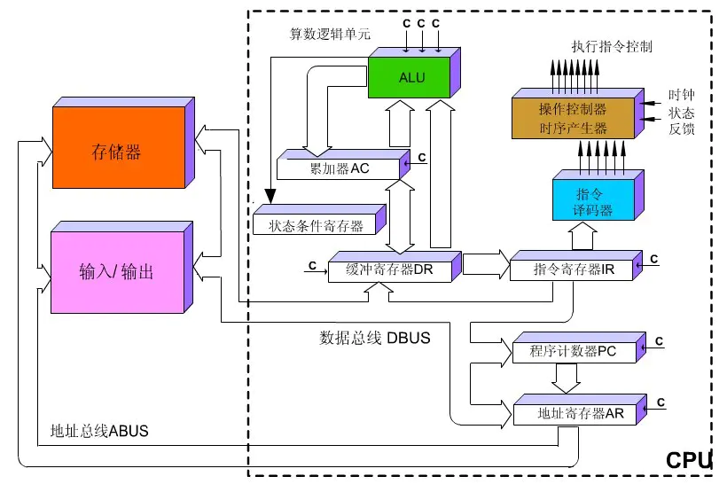

本篇是我本人博客中的专题“追根溯源 从C++到汇编”中的开篇。这是我第一次尝试写一个系列的文章出来与大家分享。如果有什么疏漏，欢迎大家指正。

为了阐述C++和汇编的关系，我觉着有必要简单介绍下汇编知识和一些计算机的基本组成。本篇的内容尽量保持简短。本篇的目的是为了后续的讲解做一个基础性的铺垫与简介，点到即止。

本文假定读者没有任何汇编基础知识。如果有读者对汇编很熟悉，可以略过本篇，参看系列后续的文章。

<!-- more -->

# 疑惑：程序到底是怎么执行的
现代计算机自图灵机理论诞生以来经历了高速发展。互联网时代，网络和移动平台正在深刻地改变这个社会。作为程序员，我们每天都在产出代码，这些代码在特定的平台和运行时系统支撑下运行，我们都早已习以为常。
但是如果你问一个程序员：你写的程序为什么能执行？大概他会一愣，然后抛出各种理论：因为编译器啊，因为jvm运行时啊，因为语言机制啊等等不一而足。其实这个问题就好比你去问一个大学生：1+1=2是个什么原理。也许在程序员看来，“程序为什么能运行”根本就不是问题，或者说算是个哲学问题？

其实很多时候，我们都不会去思考这种问题，因为它太基础，但是今天，我想尝试从汇编的角度解释下这个问题。

# 从汇编层面解释程序执行
## 1. cpu工作原理
这个话题扯开来说很大，我们尽量简单点理解它。

### 1.1 机器码与指令集
我们都知道，cpu是计算机的逻辑运算核心。我们写的程序代码，在编译为二进制后，最终会由cpu来执行（当然，gpu现在也能执行运算，这个我们暂且不表）。那为什么cpu能够理解二进制的0101代表什么意思？因为cpu指令集。

不同的cpu在设计的时候，就被设计为支持某种指令的编码格式，我们称之为cpu指令集。不同的cpu支持不同的指令集。比如我们经常听到的MMX，SSE，都是指令集的一种。使用软件可以查询不同cpu支持的指令集，比如下面一张图：

Paste_Image.png
可以看到i5处理器已经支持了很多的指令集。

### 1.2 执行过程
CPU的基本工作是执行存储的指令序列，即程序。程序的执行过程实际上是不断地取出指令、分析指令、执行指令的过程。几乎所有的冯•诺伊曼型计算机的CPU，其工作都可以分为5个阶段：取指令、指令译码、执行指令、访存取数和结果写回。

我们可以简单理解为，cpu在控制器，存储器，数据总线等多种部件的协调下，以一种流水线的方式取出要执行的二级制代码序列，使用内部的指令集来理解并执行每一条指令。这其中又会涉及到指令周期，时钟周期，cpu主频等概念。一个cpu的内部结构图大概如下图所示：

## 2. x86汇编和二进制机器码
按照前面我们所说，不同的cpu支持不用的指令集（其实这里的概念应该从架构上来说）。也就是说，不同的cpu架构其实存在不同的汇编语言。在pc上广泛使用的cpu架构和汇编是intel公司的80x86系列和对应的x86汇编。
汇编指令可以通过汇编编译器翻译成对应的二进制指令，进而由cpu直接执行。汇编指令和二进制机器码直接对应，可以通过查阅intel的cpu技术文档了解这种对应关系的具体细节。

## 3. 寄存器的概念和x86 cpu中的寄存器
关于寄存器的基本概念，百度百科是这样解释的

> 在计算机领域，寄存器是CPU内部的元件，包括通用寄存器、专用寄存器和控制寄存器。寄存器拥有非常高的读写速度，所以在寄存器之间的数据传送非常快。
寄存器是内存阶层中的最顶端，也是系统获得操作资料的最快速途径。

简单点理解，寄存器是最高速的内存单元，与cpu直连，拥有最快的访问和存取速度。我们一般意义上的内存，比之寄存器，速度上就没得比了。寄存器的意义在于，为cpu提供了一种快速速度存取途径，加速了cpu的运行速度。

> 32位CPU所含有的寄存器如下：
> 4个数据寄存器(EAX、EBX、ECX和EDX)
> 2个变址和指针寄存器(ESI和EDI)
> 2个指针寄存器(ESP和EBP)
> 6个段寄存器(ES、CS、SS、DS、FS和GS)
> 1个指令指针寄存器(EIP)
> 1个标志寄存器(EFlags)

这些寄存器的作用，在此不做详细解释。在x86汇编中，我们会直接使用这些寄存器来进行运算。因为本篇并不是一个x86汇编的教学帖，我们会在后面的讲解中对用到的寄存器做一些补充说明。

# 结束语
本篇在此打住，也许各位看官仍然有很多不理解的部分，因为本篇的介绍实在是有些过于简单。但是相信我，我们的主题从来都不是机器码，二进制，汇编。我们会在后续的章节中，探究一些关于C++语言层面的问题，又或者是一些代码安全问题。我会努力把更多精彩的文章带给大家，我们拭目以待。

参考资料
[计算机原理学习（1）-- 冯诺依曼体系和CPU工作原理](https://blog.csdn.net/cc_net/article/details/10419645)
[百度百科-寄存器](https://baike.baidu.com/item/%E5%AF%84%E5%AD%98%E5%99%A8/187682?fr=aladdin)