从本篇开始，我们讨论一些高级语言中的基础设施：堆栈，函数调用，变量生命周期等等话题。因为这里本身会涉及到比较多的汇编层面的基础概念。为了向大家说明汇编层的函数调用实现细节，无奈我只能罗列出很多汇编上的概念，因为本文假定读者不需要具有任何汇编知识。我讨厌长篇大论，但本篇的解释可能仍然不够明晰。在此为自己知识的浅薄表示歉意。

<!-- more -->

# 从代码的顺序执行说起
每一个程序员脑子里应该都有这么一种印象：“程序是顺序执行的”。这个观点其实和我们开篇所讲的cpu的流水线执行过程直接相关。
让我们再回忆一下脑海中关于函数调用的概念，也许会是这个样子：

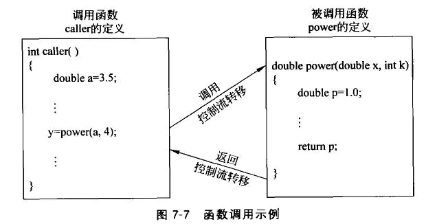
这里的“控制流转移”又是如何发生的呢？在解释这个之前，也许我们需要科普一点有关于汇编的知识。

# 函数调用中的一些细节说明
## 函数调用中的关键寄存器
### 程序计数器PC
程序计数器是一个计算机组成原理中讲过的概念，下面给出一个百度百科中的简单解释

程序计数器是用于存放下一条指令所在单元的地址的地方。
当执行一条指令时，首先需要根据PC中存放的指令地址，将指令由内存取到指令寄存器中，此过程称为“取指令”。与此同时，PC中的地址或自动加1或由转移指针给出下一条指令的地址。此后经过分析指令，执行指令。完成第一条指令的执行，而后根据PC取出第二条指令的地址，如此循环，执行每一条指令。

可以看到，程序计数器是一个cpu执行指令代码过程中的关键寄存器：它指向了当前计算机要执行的指令地址，CPU总是从程序计数器取出当前指令来执行。当指令执行后，程序计数器的值自动增加，指向下一条将要执行的指令。

在x86汇编中，执行程序计数器功能的寄存器被叫做EIP，也叫作指令指针寄存器。

### 基址指针，栈指针和程序栈
栈是程序设计中的一种经典数据结构，每个程序都拥有自己的程序栈。很重要的一点是，栈是向下生长的。所谓向下生长是指从内存高地址->低地址的路径延伸，那么就很明显了，栈有栈底和栈顶，那么栈顶的地址要比栈底低。对x86体系的CPU而言，其中
---> 寄存器ebp（base pointer ）可称为“帧指针”或“基址指针”，其实语意是相同的。
---> 寄存器esp（stack pointer）可称为“ 栈指针”。
在C和C++语言中，临时变量分配在栈中，临时变量拥有函数级的生命周期，即“在当前函数中有效，在函数外无效”。这种现象就是函数调用过程中的参数压栈，堆栈平衡所带来的。对于这种实现的细节，我们会在接下来的环节中详细讨论。

## 堆栈平衡
堆栈平衡这个概念指的是函数调完成后，要返还所有使用过的栈空间。这种说法可能有点抽象，我们可以举一个简单的例子来类比：
我们都知道函数的临时变量存放在栈中。那我们来看下面的代码，它是一个很简单的函数,用来交换传入的2个参数的值：

````C++
void __stdcall swap(int& a,int& b)
{
  int c = a;
  a = b;
  b = c;
}
````
我们可以看到，在这个函数中使用了一个临时变量int c;这个变量分配在栈中，我们可以简单的理解为，在声明临时变量c后，我们就向当前的程序栈中压入了一个int值：

````C++
int c = a; <==> push(a);   //简单粗暴，临时变量的声明理解为简单地向栈中push一个值。
````
那现在这个函数swap调用结束了，我们是否需要退栈，把之前临时变量c使用的栈空间返还回去？需要吗？不需要吗？
我们假设不需要，当我们频繁调用swap的时候，会发生什么？每次调用，程序栈都在 **生长**。直到栈满，我们就会收到**stack overflow**错误，程序挂掉了。
所以为了避免这种乌龙的事情发生，我们需要在函数调用结束后，退栈，把堆栈还原到函数调用前的状态，这些被pop掉的临时变量，自然也就失效了，这也解释了我们一直以来关于**临时变量仅在当前函数内有效**的认知。其实堆栈平衡这个概念本身比这种粗浅的理解要复杂的多，还应包括压栈参数的平衡，暂时我们可以简单地这样理解，后面再做详细说明。

## 函数的参数传递和调用约定
函数的参数传递是一个参数压栈的过程。函数的所有参数，都会依次被push到栈中。那调用约定有是什么呢？
C和C++程序员应该对所谓的调用约定有一定的印象，就像下面这种代码：

````C++
void __stdcall add(int a,int b);
````

函数声明中的__stdcall就是关于调用约定的声明。其中标准C函数的默认调用约定是__stdcall,C++全局函数和静态成员函数的默认调用约定是__cdecl，类的成员函数的调用约定是__thiscall。剩下的还有__fastcall，__naked等。

为什么要用所谓的**调用约定**？调用约定其实是一种约定方式，它指明了函数调用中的参数传递方式和堆栈平衡方式。

### 参数传递方式
还是之前那个例子，swap函数有2个参数，int a,int b。这两个参数，入栈的顺序谁先谁后？
其实是从左到右入栈还是从右到左入栈都可以，只要函数调用者和函数内部使用相同的顺序存取参数即可。在上述的所有调用约定中，参数总是从右到左压栈，也就是最后一个参数先入栈。我们可以使用一份伪代码描述这个过程

````asm
push b;      //先压入参数b
push a;      //再压入参数a
call swap;  //调用swap函数
````
其实从这里我们就可以理解为什么在函数内部，不能改变函数外部参数的值：因为函数内部访问到的参数其实是压入栈的变量值，对它的修改只是修改了栈中的"副本"。指针和引用参数才能真正地改变外部变量的值。

### 堆栈平衡方式
因为函数调用过程中，参数需要压栈，所以在函数调用结束后，用于函数调用的压栈参数也需要退栈。那这个工作是交给调用者完成，还是在函数内部自己完成？其实两种都可以。调用者负责平衡堆栈的主要好处是可以实现可变参数（关于可变参数的话题，在此不做过多讨论。如果可能的话，我们可以以一篇单独的文章来讲这个问题），因为在参数可变的情况下，只有调用者才知道具体的压栈参数有几个。
下面列出了常见调用约定的堆栈平衡方式：

|调用约定|	堆栈平衡方式|
|---|---|
|__stdcall	| 函数自己平衡|
|__cdecl	| 调用者负责平衡|
|__thiscall	| 调用者负责平衡|
|__fastcall	| 调用者负责平衡|
|__naked	| 编译器不负责平衡，由编写者自己负责|
## 栈帧的概念：从esp和ebp说起
为什么我们需要ebp和esp2个寄存器来访问栈？这种观念其实来自于函数的层级调用：函数A调用函数B，函数B调用函数C，函数C调用函数D...
这种调用可能会涉及非常多的层次。编译器需要保证在这种复杂的嵌套调用中，能够正确地处理每个函数调用的堆栈平衡。所以我们引入了2个寄存器：

1. ebp指向了本次函数调用开始时的栈顶指针，它也是本次函数调用时的“栈底”（这里的意思是，在一次函数调用中，ebp向下是函数的临时变量使用的空间）。在函数调用开始时，我们会使用
````asm
mov ebp,esp 
````
把当前的esp保存在ebp中。

2. esp，它指向当前的栈顶，它是动态变化的，随着我们申请更多的临时变量，esp值不断减小（正如前文所说，栈是向下生长的）。
3. 函数调用结束，我们使用
````asm
mov esp,ebp
````
来还原之前保存的esp。
在函数调用过程中，ebp和esp之间的空间被称为本次函数调用的“栈帧”。函数调用结束后，处于栈帧之前的所有内容都是本次函数调用过程中分配的临时变量，都需要被“返还”。这样在概念上，给了函数调用一个更明显的分界。下图是一个程序运行的某一时刻的栈帧图：

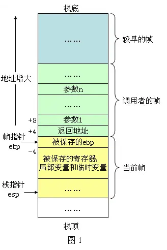
# 汇编中关于“函数调用”的实现
上面铺陈了很多的汇编层面的概念后，我们终于可以切回到我们本次的主题：函数调用。
函数调用其实可以看做4个过程，也就是本篇标题：

1. 压栈: 函数参数压栈，返回地址压栈
2. 跳转: 跳转到函数所在代码处执行
3. 执行: 执行函数代码
4. 返回: 平衡堆栈，找出之前的返回地址，跳转回之前的调用点之后，完成函数调用
##  call指令 压栈和跳转
下面我们看一下函数调用指令

````asm
0x210000 call swap;
0x210005 mov ecx,eax; 
````
我们可以把它理解为2个指令：

````asm
push 0x210005;
jmp swap;
````
也就是，首先把call指令的下一条指令地址作为本次函数调用的返回地址压栈，然后使用jmp指令**修改指令指针寄存器EIP**，使cpu执行swap函数的指令代码。

## ret指令 返回
汇编中有ret相关的指令，它表示取出当前栈顶值，作为返回地址，并将指令指针寄存器EIP修改为该值，实现函数返回。
下面给出一组示意图来演示函数的返回过程：

1. 当前EIP的值为0x210004，指向指令ret 4，程序需要返回

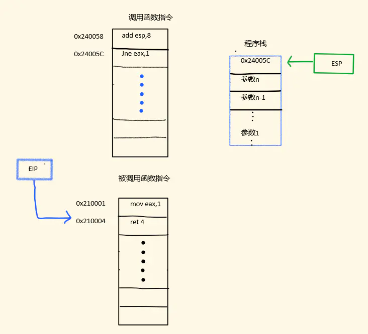

2. 执行ret指令，将当前esp指向的堆栈值当做返回地址，设置eip跳转到此处并弹出该值
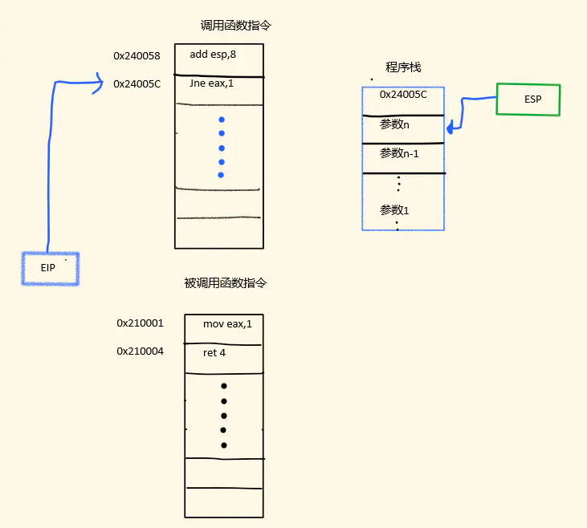

经过这两步，函数就返回到了调用处。

# 从实际汇编代码看函数调用
## 程序源码和运行结果
源码：
````C++

main.cpp

#include <stdio.h>
 
void __stdcall swap(int& a, int& b);
 
int main(int argc, char* argv)
{
    int a = 1, b = 2;
    printf("before swap: a = %d, b = %d\r\n", a, b);
    swap(a, b);
    printf("after swap: a = %d, b = %d\r\n", a, b);
}
 
 
void __stdcall swap(int& a, int& b)
{
    int c = a;
    a = b;
    b = c;
}
````
程序运行结果：

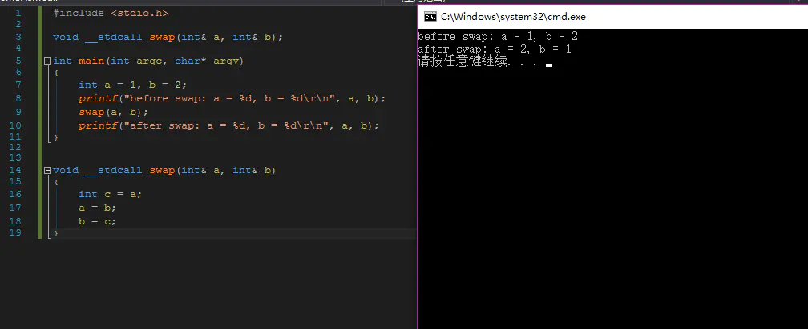
4.2 反汇编
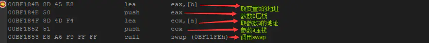
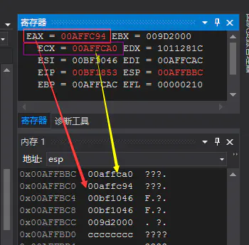

可以看到，在函数调用前，函数参数已被压栈，此时:
> EBP = 00AFFCAC
> ESP = 00AFFBBC
> EIP = 00BF1853

我们按F11，进入函数内部，此时：
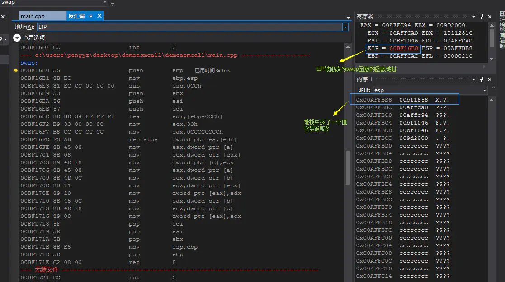
其实就是call swap指令的下一条指令地址，它就是本次函数调用的**返回地址**。
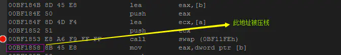
下面是一个swap函数的详细注释：

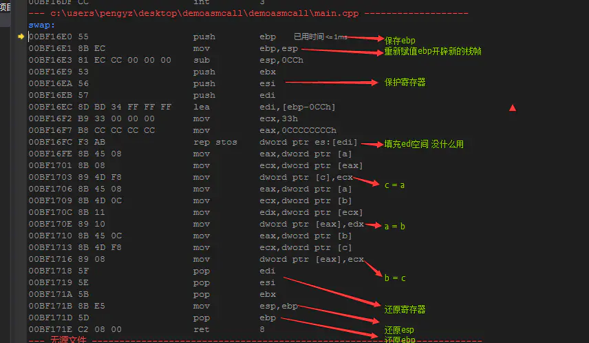
当程序运行到ret 8时


执行返回后：
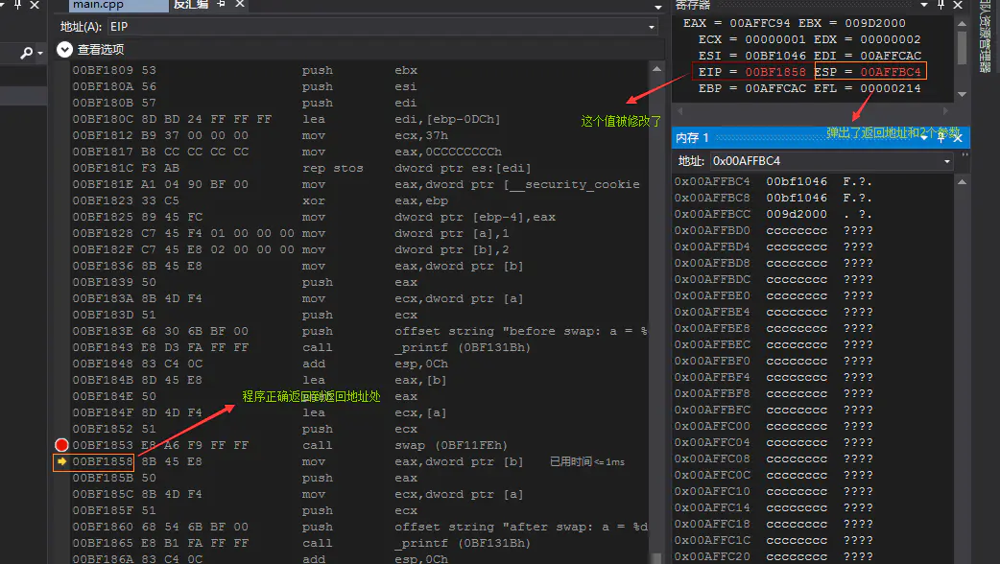

在返回前，ESP = 00AFFBB8，返回后 ESP = 00AFFBC4
0x00AFFBC4 - 0x00AFFBB8 = 0xC
这里的数值是字节数，而我们知道，int是4字节长度。所以0xC/4 = 3
正好是2个压栈参数+一个返回地址。

## 调用堆栈
调试程序的时候，我们经常关注的一个点就是VisualStudio显示给我们的“调用堆栈”功能，这次让我们来仔细看一下它：
我们重新执行一次程序，这次我们关注一下vs显示的调用堆栈，如下图

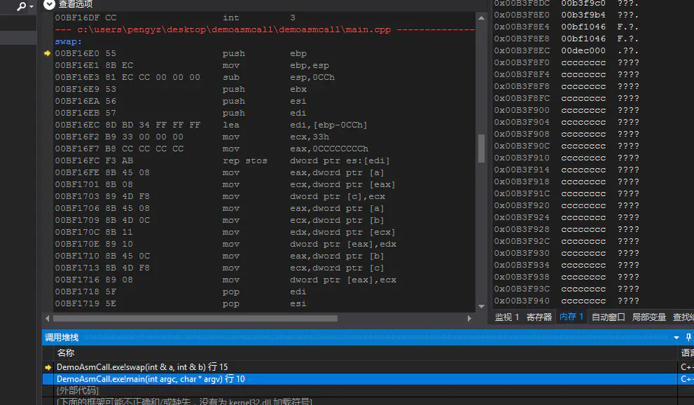

第一行是当前指令地址
第二行是外层调用者，我们双击它，跳转到如下地址：

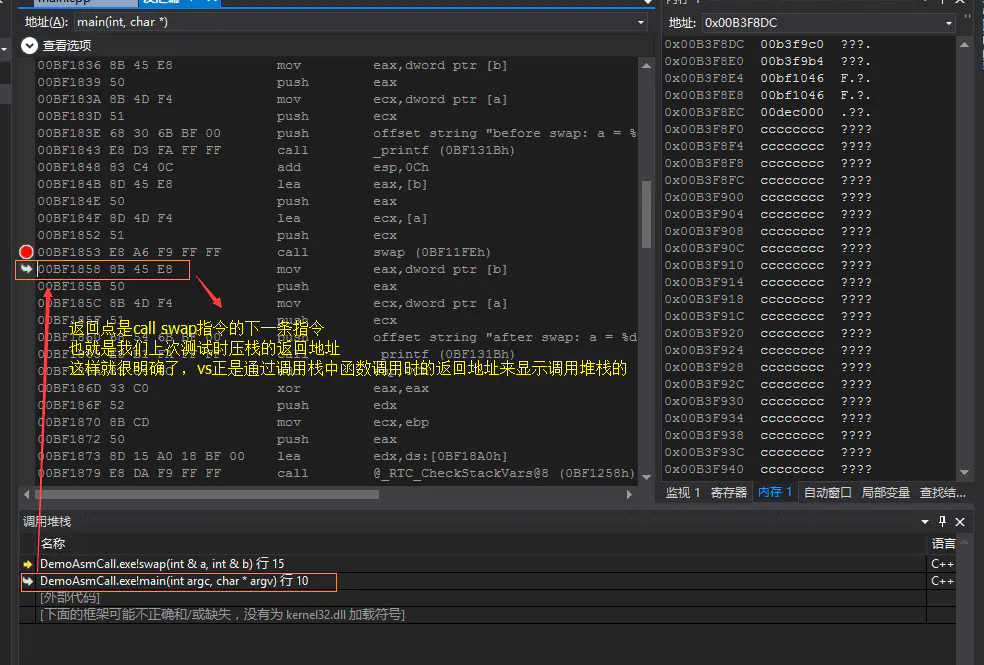
也许这也是为什么这个功能被叫做“调用堆栈”的原因：它正是通过对程序栈的分析实现的。

# 结束语
虽然我刻意压缩了很多的内容，但是为了把函数调用在汇编层面的实现问题解释清楚，本篇文章仍然很长。因为有太多的汇编前置知识需要解释，而我有不想脱离这个话题单独去谈论汇编，这样没有什么意义。
本篇作为追根溯源 从C++到汇编系列文章的第一篇“干货”，希望大家喜欢。写了这么多，难免有所疏漏，欢迎大家批评指正。
当然，作为一篇介绍性的文章，内容难免有所删减。比如，本文没有对ret n这种平衡方式做详细解释，也没有对各种汇编代码的含义做解释，还有引用参数的压栈方式，各种调用约定的具体使用情况和区别。当然，限于篇幅，有些东西无法面面俱到。但还是希望大家能够喜欢本篇文章。
你的鼓励，就是我最大的动力。

# 参考文档
[百度百科-程序计数器](https://baike.baidu.com/item/%E7%A8%8B%E5%BA%8F%E8%AE%A1%E6%95%B0%E5%99%A8?fr=aladdin)
[c函数调用过程原理及函数栈帧分析](https://blog.csdn.net/zsy2020314/article/details/9429707)

