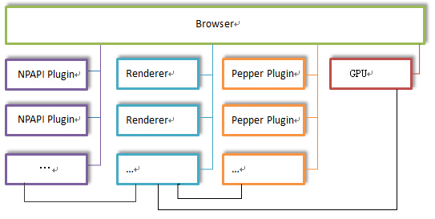
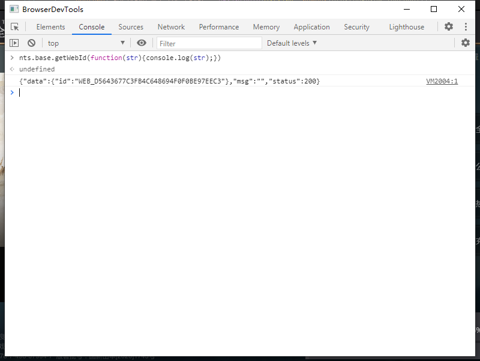

# 1. 重构版Launcher的技术方案

## 简单的对比
多厂商Launcher本身是一个使用QT作为界面库，CEF作为内嵌浏览器，使用C++语言进行开发的桌面程序。多厂商Launcher存在很多的问题，在决定重构之后，对后续的技术方案进行了一番考量，具体的对比如下：

||多厂商|重构版|
|--|--|--|
|Qt版本|5.6.3|5.12.6|
|CEF版本|76.0.3809.162 (支持XP+) |86.0.4044.132 (支持win7+)|
|VS版本|VS 2013| VS 2017|
|构建系统|VS工程+CMake|CMake|
|版本升级方式|大网易的补丁升级系统|ngl-pacman工具|
|打包方式|bash脚本和cmd脚本|bash脚本|

下面是一些简单的说明：
* 重构版Launcher不再支持xp，故Qt版本选用了最新的LTS版本，VS版本选用2017方便使用更新的C++标准。 
* 内嵌浏览器考虑过使用QtWebEngine，此模块是Qt官方对chromium进行的封装，可以方便地与Qt程序集成，但后续考虑到游戏内商城需要进行离屏渲染， QtWebEngine未开放相应接口，故放弃，继续使用CEF但对CEF版本进行了升级。
* 对工程结构进行了整理和简化，全部使用CMake进行构建，可以方便地跨平台，VS2017本身也对CMake提供了良好的支持。
* 大网易的补丁升级系统更适合对游戏进行升级，需要依次应用所有补丁，过于繁琐。创建了一个独立进程完成升级功能，可以跨版本进行升级。

<!-- more -->

## 内嵌浏览器需要完成的功能

Launcher本身是一个重Web的项目，开发过程中考虑过使用Electron来实现，但纯web技术栈做游戏Launcher存在不少的限制，安全性上也存在很大的挑战，最终走回了应用内嵌浏览器的解决方案。内嵌浏览器需要完成如下功能：
* 提供浏览器环境，加载和显示网页。
* 将C++函数暴露给浏览器，提供底层数据存储，游戏下载，npl stub集成功能。
* 支持传入和触发JavaScript回调。
* 支持绑定native属性到JavaScript环境。
* 为网页提供跨页面数据访问和事件注册/触发功能。
* 提供离屏渲染功能用于显示游戏内商城。

基于以上需求，重构版使用了一个开源的CEF QT封装层QCefView并对它进行了大量的改造，添加了基于Qt反射的函数和属性自动绑定层，对离屏渲染进行了实现。


# 2. CEF介绍

## 2.1 简介
Chromium Embedded Framework (CEF)是一个将基于Chromium的浏览器嵌入到应用程序中的简单框架。
> ### 背景
> The Chromium Embedded Framework (CEF)是一个由Marshall Greenblatt于2008年创建的开源项目，旨在开发基于Google Chromium项目的Web浏览器控件。CEF目前支持一系列编程语言和操作系统，可以很容易地集成到新的和现有的应用程序中。它从一开始就考虑到性能和易用性。基础框架包括通过本地库导出的C和C++编程接口，它们将宿主应用与Chromium和Blink的实现细节隔离。它提供浏览器控件和宿主应用程序之间的紧密集成，包括对自定义插件、协议、JavaScript对象和JavaScript扩展的支持。宿主应用程序可以选择性地控制资源加载、导航、上下文菜单、打印等，同时获得与Google Chrome浏览器相同的性能优势和HTML5技术支持。
> ### 依赖
> CEF项目依赖于由第三方维护的许多其他项目。CEF依赖的主要项目有：
> 
> * Chromium - 提供创建一个功能齐全的Web浏览器所需的网络堆栈、线程、消息循环、日志记录和进程控制等常规功能。实现允许Blink与V8和Skia通信的“平台”代码。许多Chromium设计文件可以在 http://dev.chromium.org/developers 找到。
> * Blink（以前叫WebKit）——Chromium使用的渲染实现。提供DOM解析、布局、事件处理、呈现和html5 Javascript API。一些HTML5实现被分散在Blink和Chromium代码库之间。
> * V8 - JavaScript 引擎.
> * Skia - 用于渲染非加速内容的二维图形库。关于铬是如何整合Skia的更多信息可以在 *[这里](http://www.chromium.org/developers/design-documents/graphics-and-skia)* 找到。
> * Angle - 为Windows实现的3D图形转换层，用于将GLES调用转换为DirectX调用。有关acclerated composing的更多信息，请访问 *[此处](http://dev.chromium.org/developers/design-documents/gpu-accelerated-compositing-in-chrome)* 。
> 
> ### CEF3实现细节
> 自2013年1月以来，CEF3一直是CEF的推荐和支持版本。它通过Chromium Content API来使用与Chromium Web浏览器相同的多进程体架构。与使用单进程体架构的 CEF1（已废弃）相比，该体系结构具有许多优势：
> 
> * 支持多进程运行模式
> * 与Chromium浏览器共享更多代码
> * 基于上一条，由于使用了“受支持”的代码路径，因此性能得到了改善，功能破坏次数更少。
> * 更快地跟进Chromium更新以访问新功能
> 在大多数情况下，CEF3将具有与Chromium Web浏览器相同的性能和稳定性特性。

Chromium的多进程架构
> 

## 2.2 应用程序结构

> 每一个CEF3应用程序都拥有相同的总体结构：
> 
> 提供一个入口点函数，该函数初始化CEF并执行渲染子进程逻辑或CEF消息循环。
> 提供CefApp的实现来处理特定于进程的回调。
> 提供CefClient的实现来处理特定于浏览器实例的回调。
> 调用CefBrowserHost:：CreateBrowser（）创建浏览器实例并使用CefLifeSpanHandler管理浏览器的生命周期。
> ## 入口点函数
> CEF3应用程序将运行多个进程。进程可以使用相同的可执行文件，也可以为子进程指定单独的可执行文件。流程的执行从入口点函数开始。针对Windows、Linux和macos-X的完整平台特定示例在cefclient/cefclient_win.cc, cefclient/cefclient_gtk.cc and cefclient/cefclient_mac.mm等文件中提供。
> 启动子进程时，CEF将使用命令行指定配置信息，这些信息必须通过CefMainArgs结构传递到CefExecuteProcess函数。CefMainArgs的定义是特定于平台的。

CEF使用多进程架构，用于管理窗口创建，绘制，网络访问的进程被叫做“Browser进程”，一般也是我们的应用程序所在的进程，页面渲染和Javascript的执行发生在另一个分离的进程，我们称之为“Render进程”，想要使用CEF，我们要分别**实现**浏览器进程和渲染进程。

Browser进程入口点
````C++
int main(int argc, char* argv[]) {

  // 用于传递命令行参数的结构
  // 此结构的定义是平台相关的
  CefMainArgs main_args(argc, argv);

  // CefApp 接口的可选实现
  CefRefPtr<MyApp> app(new MyApp);

  // Populate this structure to customize CEF behavior.
  CefSettings settings;

  // 填充此结构以自定义CEF行为。
  CefString(&settings.browser_subprocess_path).FromASCII(“/path/to/subprocess”);

  // 在主进程中初始化CEF
  CefInitialize(main_args, settings, app.get());

  // 运行CEF消息循环。在调用CefQuitMessageLoop（）之前，此函数调用将被阻塞。
  CefRunMessageLoop();

  // 关闭 CEF.
  CefShutdown();

  return 0;
}
````
渲染进程入口点
````C++
int main(int argc, char* argv[]) {

  CefMainArgs main_args(argc, argv);

  CefRefPtr<MyApp> app(new MyApp);

  // 执行子进程逻辑。此调用将被阻塞，直到子进程退出。
  return CefExecuteProcess(main_args, app.get());
}
````

## 2.3 C++和JavaScript的互调用

### C++调用JavaScript
CEF提供了相应的接口可以直接使用
````C++
browser->GetMainFrame()->ExecuteJavaScript("__GDATA__.toogleLogin();");
````

### JavaScript调用C++
需要将C++接口绑定到当前web页面的JavaScript上下文中，注册Native函数到JavaScript中的方法如下：
````C++
//继承CefV8Handler
class QCefFunctionObject : public CefV8Handler {
public:
    virtual bool Execute(const CefString& name, CefRefPtr<CefV8Value> object, const CefV8ValueList& arguments, CefRefPtr<CefV8Value>& retval, CefString& exception) OVERRIDE
    {
      printf("function: %s executed!\n", name.toStdString().c_str());
    }
    
    ....
};
//创建handler
CefRefPtr<QCefFunctionObject> functionHandler = new QCefFunctionObject();
//通过handler创建函数对象
CefRefPtr<CefV8Value> func = CefV8Value::CreateFunction(funcInfo.name.toStdWString(), functionHandler);
//获取页面全局window对象
CefRefPtr<CefV8Value> objWindow = context->GetGlobal();
//将函数对象插入到window对象中
objWindow->SetValue("test", func, V8_PROPERTY_ATTRIBUTE_NONE);
````
在控制台执行如下JavaScript函数
````javascript
window.test();
````
得到输出：function: test executed!

# 3. 注册C++函数给JavaScript调用

Launcher中界面主要由web构建，如果按照MVC模式进行分层，Web处于Wiew和Controller层，C++更多时候充当一个model层：提供游戏下载安装信息，stub功能集成，窗口的打开关闭控制等。C++通过注册Native函数到JavaScript中，为web提供增强功能，以便web更好地实现业务功能。
基于这种逻辑分层关系，随着业务需求的变更，C++经常要和web协商添加新的接口，注册新的函数到JavaScript中，所以简化这个注册流程是很有必要的，可以有效地降低开发工作量。

## 3.1 一个典型的JavaScript接口调用过程


可以看到，C++函数本身位于Browser进程（Launcher进程）中，JavaScript函数到额执行在render进程中，所以这里是一个典型的IPC跨进程调用过程。render进程中的函数只是一个stub，它仅用于将调用请求转发给browser进程。
## 3.2 手动注册C++函数遇到的问题
如果我们手动来给每一个C++函数做绑定，我们需要在两个项目中同时添加代码，繁琐而且容易出错。
在Browser进程响应IPC消息的时候，我们的代码中必然会出现一个如下分派代码：
````C++
if (functionName == "getWebId") {
  //调用getWebId
  auto strWebId = obj.getWebId();
  ...
} else if (functionName == "startDownload") {
  //调用startDownload
  auto gameVersion = params.GetString(0);
  auto downloadPath=params.GetString(1);
  auto result = obj.startDownload(gameVersion, downloadPath);
  ...
} else if (...) {
  ...
}
````
因为JavaScript是一种动态脚本，而C++是编译型强类型语言，因此收到IPC消息后要根据C++函数签名对参数数量和类型做合法性校验，写起来很繁琐。

在Render进程的CefV8Handler::Execute接口中，我们需要手动去拼接IPC消息，
每当添加一个新的JavaScript接口，都需要在此处添加新的序列化代码。这种重复性的工作最好能交给程序自动完成而不需要人工介入，这样就可以尽可能地简化工作量，提高开发效率。

## 3.3 解决思路

CEF中C++函数调用是一个典型的IPC调用过程，render进程中仅存在一个stub函数，将函数调用序列化后通过IPC消息通知给browser进程，browser进程执行完真整的函数调用后，通过IPC消息将结果发送回render进程。
所以问题的关键是，如果我们能在render进程中拿到要注册的C++函数的完整函数签名（函数名，参数数量，参数类型），我们就可以以此为基础注册一个同名的JavaScript函数，当这个函数被调用时，将函数调用信息（函数名，参数等）序列化并通过CEF标准的IPC通信机制发送给browser进程。browser进程解析IPC消息，根据调用函数名查找函数元信息，校验调用参数并最终通过反射执行对应的C++函数，最后将执行结果通过IPC消息发回render进程，完成整个调用过程。

C++本身不支持反射但是Qt是支持的，可以在Qt元对象系统和反射的基础上实现自动绑定。

## 3.4 具体实现
### 3.4.1. browser进程中以指定的名字注册一个QObject的子类对象
````C++
QCefJavaScriptEngine::get()->registerObject("base", new JSObjectBase(this));
````
### 3.4.2. 注册细节：遍历元对象，获取函数签名信息，写入共享内存
````C++
bool QCefObjectProtocol::registerJavaScriptHandlerObject(const QString& registerName, const QObject* registerObject) {
  //获取元对象
  auto metaObj = registerObject->metaObject();
  QJsonObject registerObjInfo;
  registerObjInfo.insert("registerName", registerName);
  registerObjInfo.insert("className", metaObj->className());
  for (int i = 0; i < metaObj->methodCount(); i++) {
    //获取函数名，函数签名，参数
    functionInfo.insert("functionName", QString::fromUtf8(metaMethod.name()));
    functionInfo.insert("functionSignature", QString::fromUtf8(metaMethod.methodSignature()));
    functionInfo.insert("returnType", metaMethod.returnType());
    //遍历参数列表
    for (int j = 0; j < metaMethod.parameterCount(); j++) {
      //获取参类型名和参数名，添加到Json Array中
    }
    //添加到Json Array
  }
  //将序列化好的函数注册信息Json写入到共享内存
  writeJsObjectRegisterInfo(jsonStr);
}
````
### 3.4.3. render进程初始化时解析Json信息并完成注册
````C++
bool QCefJavaScriptBinder::initRegisterObjectsData(const QString& jsonData)
{
    //解析注册信息，将函数签名信息反序列化为结构体，最终以注册名为key保存在map里
    ...
    m_javaScriptMetaObjectMap[regName] = objectInfo;
    return true;
}
````
### 3.4.4. 浏览器对象创建时（OnContextCreated接口调用），注册所有的C++函数
````C++
void* QCefJavaScriptBinder::bindAllObjects(CefRefPtr<CefV8Value> parentObj, CefRefPtr<CefBrowser> browser, CefRefPtr<CefFrame> frame)
{
    QCefJavaScriptEnvironment* pJsEnv = new QCefJavaScriptEnvironment();
    QStringList allRegisterNames = m_javaScriptMetaObjectMap.keys();
    for (const auto& regNameKey : allRegisterNames) {
        //一些必要的校验判断
        ...
        JavaScriptMetaObject& metaInfo = m_javaScriptMetaObjectMap[regNameKey];
        CefRefPtr<QCefJavaScriptObject> jsObj = new QCefJavaScriptObject(metaInfo, browser, frame);
        //根据函数注册信息完成C++函数到JavaScript环境的自动注册
        jsObj->registerObject(pJsEnv, regNameKey.toStdWString(), parentObj);
    }

    return pJsEnv;
}
````
### 3.4.5. 注册细节：
````C++
bool QCefJavaScriptObject::registerObject(QCefJavaScriptEnvironment* pJsEnv, CefString registerName, CefRefPtr<CefV8Value> cefParentObj)
{
    //遍历找到正确的parent对象
    ...
    //如果当前对象为空，创建它
    if (!currObjValue)
        currObjValue = CefV8Value::CreateObject(this, nullptr);
    //遍历所有的function注册信息
    for (const JavaScriptMetaMethod& funcInfo : m_metaObject.functions) {
        //创建handler实例用于响应JavaScript函数调用
        CefRefPtr<QCefFunctionObject> functionHandler = new QCefFunctionObject(funcInfo, m_browser, m_frame);
        //使用handler创建JavaScript函数，它是一个CefV8Value的实例
        CefRefPtr<CefV8Value> func = CefV8Value::CreateFunction(funcInfo.name.toStdWString(), functionHandler);
        //将handler保存在map中，方便后续访问
        m_functionMap.insert(funcInfo.name, functionHandler);
        //将新创建的函数对象插入到当前JS对象中
        currObjValue->SetValue(funcInfo.name.toStdWString(), func, V8_PROPERTY_ATTRIBUTE_NONE);
    }
    ...
    return true;
}
````
### 3.4.6. QCefFunctionObject::Execute实现
````C++
bool QCefFunctionObject::Execute(const CefString& name, CefRefPtr<CefV8Value> object,
    const CefV8ValueList& arguments, CefRefPtr<CefV8Value>& retval, CefString& exception)
{
    //创建CEF标准的IPC消息，消息名为QCEF_INVOKENGLMETHOD
    CefRefPtr<CefProcessMessage> msg = CefProcessMessage::Create(QCEF_INVOKENGLMETHOD);
    //获取调用参数列表
    CefRefPtr<CefListValue> args = msg->GetArgumentList();
    //获取browserId和frameId，前者是浏览器内部唯一标识，后者是frame内部唯一标识
    int browserId = m_browser->GetIdentifier();
    int64 frameId = m_frame->GetIdentifier();

    int idx = 0;
    //消息格式: browserId, frameId, C++类名，调用函数名，回调函数签名，参数列表
    args->SetString(idx++, QString::number(browserId).toStdString());
    args->SetString(idx++, QString::number(frameId).toStdString());
    args->SetString(idx++, m_metaMethod.className.toStdWString());
    args->SetString(idx++, name);
    args->SetString(idx++, m_metaMethod.signature.toStdWString());
    //check param count
    QStringList signatureList;
    QString callbackSignatures;
    int iSigIndex = idx;
    args->SetString(idx++, callbackSignatures.toStdWString());

    //序列化参数列表，根据不同的参数类型分别处理
    for (std::size_t i = 0; i < arguments.size(); i++) {
        if (arguments[i]->IsBool()) {
            args->SetBool(idx++, arguments[i]->GetBoolValue());
        } else if (arguments[i]->IsInt()) {
            args->SetInt(idx++, arguments[i]->GetIntValue());
        } else if (arguments[i]->IsDouble()) {
            double dValue = arguments[i]->GetDoubleValue();
            if (isnan(dValue)) {
                //the double value is NAN, raise an exception.
                exception = QString(u8"argument %1 is nan !").arg(i).toStdWString();
                retval = CefV8Value::CreateUndefined();
                return false;
            }
            args->SetDouble(idx++, dValue);
        } else if (arguments[i]->IsString()) {
            args->SetString(idx++, arguments[i]->GetStringValue());
        } else if (arguments[i]->IsFunction()) {
            //参数类型为函数，生成回调函数签名
            QString strUuid;
            strUuid = QUuid::createUuid().toString().toUpper();
            strUuid = strUuid.mid(1, strUuid.size() - 2);
            strUuid = strUuid.replace("-", "");
            QString callbackSig = QString("%1.%2.%3.%4.%5.%6").arg(m_browser->GetIdentifier()).arg(frameId).arg(m_metaMethod.className).arg(m_metaMethod.name)
                .arg(i).arg(strUuid);
            signatureList << callbackSig;

            QCefFunctionCallback functionCallback;
            functionCallback.callback = arguments[i];
            functionCallback.context = CefV8Context::GetCurrentContext();

            CefString callbackSignature = callbackSig.toStdWString();
            m_callbacksMap.insert(callbackSignature, functionCallback);
            TRACED("callback found at: %d, signature is: %s", i, qPrintable(callbackSig));
        } else {
            args->SetNull(idx++);
        }
    }

    //处理带返回值的同步调用，略
    ...
    // 发送IPC消息，尝试读取返回值，异步调用返回undefined
    if (m_browser && m_frame) {
        m_frame->SendProcessMessage(PID_BROWSER, msg);
        retval = readSynchronizeValue(retTypeSignature, m_metaMethod.retType);
    } else {
        retval = CefV8Value::CreateUndefined();
    }

    return true;
}
````
### 3.4.7. browser进程收到调用请求后的处理
````C++
bool QCefBrowserHandlerBase::DispatchNotifyRequest(CefRefPtr<CefBrowser> browser,
    CefProcessId source_process,
    CefRefPtr<CefProcessMessage> message)
{
    CefString messageName = message->GetName();
    CefRefPtr<CefListValue> messageArguments = message->GetArgumentList();
    if (!messageArguments)
        return false;

    int browserId = browser->GetIdentifier();
    if (messageName == QCEF_INVOKENGLMETHOD) {
        QVariantList varList;
        //遍历参数，将CEF参数列表转换为QVariantList
        for (size_t i = 0; i < messageArguments->GetSize(); i++) {
            ...
        }

        int idx = 0;
        if (QVariant::Type::String != varList[idx].type() ||
            QVariant::Type::String != varList[idx + 1].type()) {
            return false;
        }
        //获取browserId，判断是否需要处理此消息
        //browser和render是一对多的关系，当收到QCEF_INVOKENGLMETHOD消息时，需要根据browserId进行过滤，否则会重复调用
        int messageBrowserId = QString::fromStdString(varList[idx++].toString().toStdString()).toInt();
        int64 frameId = QString::fromStdString(varList[idx++].toString().toStdString()).toLongLong();
        if (messageBrowserId != browserId)
            return false;

        //执行反射调用
        QString strCallbackSignatures;
        bool bOk = QCefJavaScriptEngine::get()->inovkeMethod(browserId, varList, strCallbackSignatures);
        //调用失败，发送清理回调消息
        if (!bOk) {
            //send clear callbacks
            CefRefPtr<CefProcessMessage> msg = CefProcessMessage::Create(QCEF_CLEARNGLCALLBACKS);
            auto paramValue = msg->GetArgumentList();
            int idx = 0;
            paramValue->SetString(idx++, strCallbackSignatures.toStdWString());
            browser->GetMainFrame()->SendProcessMessage(CefProcessId::PID_RENDERER, msg);
        }
        return bOk;
    } else if (...) {
      ...
    }
}
````
### 3.4.8 Qt反射调用
````C++
bool QCefJavaScriptEngine::inovkeMethod(int browserId, const QVariantList& messageArguments, QString& callbackSignature)
{
    int messageBrowserId = QString::fromStdString(messageArguments[idx++].toString().toStdString()).toInt();
    qint64 frameId = QString::fromStdString(messageArguments[idx++].toString().toStdString()).toLongLong();
    //校验browserId
    if (messageBrowserId != browserId) {
        return false;
    }
    //校验消息格式
    //browserId className method methodSignature
    if (QVariant::Type::String != messageArguments[idx].type() ||
        QVariant::Type::String != messageArguments[idx + 1].type() ||
        QVariant::Type::String != messageArguments[idx + 2].type() ||
        QVariant::Type::String != messageArguments[idx + 3].type())
        return false;
    
    ...

    //根据IPC消息中的类名获取元对象实例
    if (!m_registeredMetaObjectMap.contains(className)) {
        TRACEE("meta method for name: %s not found !", qPrintable(className));
        return false;
    }
    const QMetaObject* metaObj = m_registeredMetaObjectMap[className];
    //校验元对象中是否存在此函数
    int iMethod = metaObj->indexOfMethod(metaObj->normalizedSignature(methodSignature.toStdString().c_str()).toStdString().c_str());
    if (iMethod == -1) {
        TRACEE("method %s index not found !", qPrintable(method));
        return false;
    }
    //获取元函数信息，以此为基础准备反射调用参数，对JS传过来的参数做适当的转换
    QMetaMethod metaMethod = m_registeredMetaObjectMap[className]->method(iMethod);

    //查找注册对象实例，后续在此对象上执行反射调用
    if (!m_jsObjectBindingMap.contains(className)) {
        TRACEE("class name: %s not found !", qPrintable(className));
        return false;
    }
    QObject* obj = m_jsObjectBindingMap[className];
    bool bNeedWrap = false;
    //参数转换，会做类型兼容处理，如果参数数量不够则补齐，多余的参数则忽略
    QVariantList varList;
    for (int i = 1; i < metaMethod.parameterCount(); i++) {
        int paramTypeId = metaMethod.parameterType(i);
        int messageIndex = idx + i;
        //转换和准备反射调用参数
        ...
    }

    bool bRet = false;
    QGenericReturnArgument retArg;
    //使用Qt的反射调用接口发起反射调用
    bRet = QMetaObject::invokeMethod(obj, qUtf8Printable(method), Qt::DirectConnection, retArg, argList[0],
        argList[1], argList[2], argList[3], argList[4], argList[5], argList[6], argList[7], argList[8], argList[9]);
    return bRet;
}
````


## 3.5 简单使用

自动绑定层实现完成之后，使用是非常方便的，仅需要定义要导出的接口，然后注册即可，新增接口时直接添加新的C++函数，无需其它繁琐步骤即可自动注到JavaScript中。
### 3.5.1 定义QObject的子类，通过Qt宏将要导出的C++接口定义为槽函数
````C++
class JSObjectBase : public QObject {
    Q_OBJECT
public:
    JSObjectBase(QObject* parent);
public slots:

    /*
    1.getWebId——获取窗口的ID
    function signature	nts.base.getWebId(ResultCallback callback)
    parameters	参数名	参数类型	参数说明
    callback
    response	参数名	参数类型	参数说明
        id	string	该页面的唯一标识

    */
    void getWebId(const JavaScriptCallbacksCollection& cbCollection);

    ....
}
````

### 3.5.2 注册Qt对象
````C++
void JavaScriptEngine::init(const QString& contextId, const QString& version, int versionCode)
{
    bool bOk = QCefJavaScriptEngine::get()->init();
    if (!bOk) {
        TRACEE("QCefJavaScriptEngine init failed !");
        return;
    }
    QCefJavaScriptEngine::get()->registerObject("base", new JSObjectBase(this));
    ...
}
````

### 3.5.3 测试
