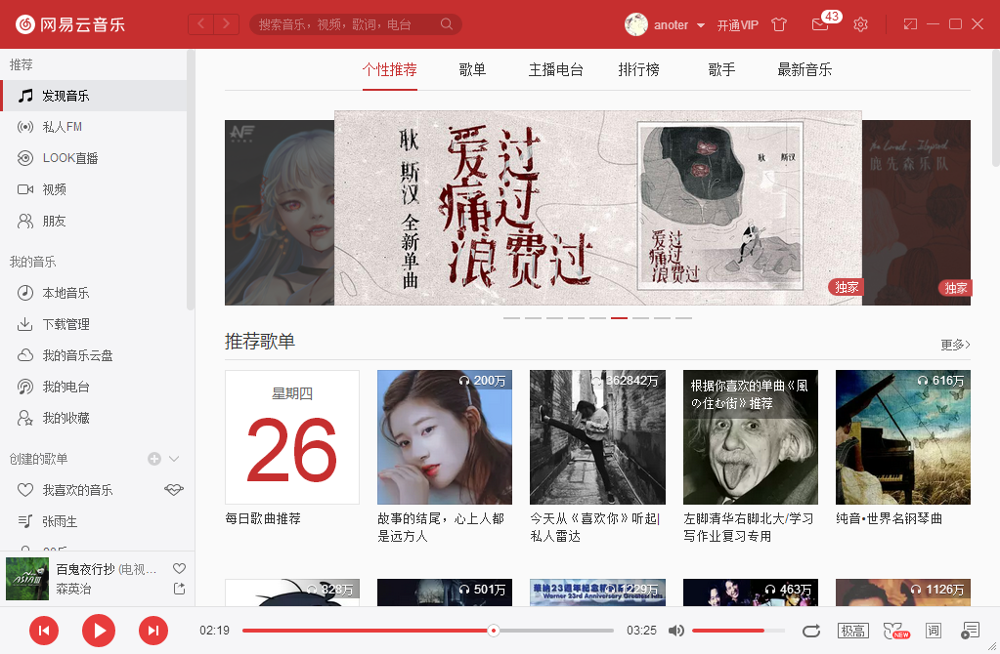

# 1. 重构版Launcher的技术方案

多厂商Launcher本身是一个使用QT作为界面库，CEF作为内嵌浏览器，使用C++语言进行开发的桌面程序。多厂商Launcher存在很多的问题，在决定重构之后，对后续的技术方案进行了一番考量，具体的对比如下：
||多厂商|重构版|
|--|--|--|
|Qt版本|5.6.3|5.12.6|
|CEF版本|76.0.3809.162 **支持XP** |86.0.4044.132 **支持win7**|
|VS版本|VS 2013| VS 2017|
|构建系统|VS工程+CMake|CMake|
|版本升级方式|大网易的补丁升级系统|ngl-pacman工具|
下面是一些简单的说明：
* 重构版Launcher不再支持xp，故Qt版本选用了最新的LTS版本，VS版本选用2017方便使用更新的C++标准。 
* 内嵌浏览器考虑过使用QtWebEngine，此模块是Qt官方对chromium进行的封装，可以方便地与Qt程序集成，但后续考虑到游戏内商城需要进行离屏渲染， QtWebEngine未开放相应接口，故放弃，继续使用CEF但对CEF版本进行了升级。
* 对工程结构进行了整理和简化，全部使用CMake进行构建，可以方便地跨平台，VS2017本身也对CMake提供了良好的支持。
* 大网易的补丁升级系统更适合对游戏进行升级，需要依次应用所有补丁，过于繁琐。创建了一个独立进程完成升级功能，可以跨版本进行升级。

# 2. 重构版Launcher体系结构简介

````C++
int main(int argc, char** argv) {
    print("hello world !");
    return 0;
}
````

